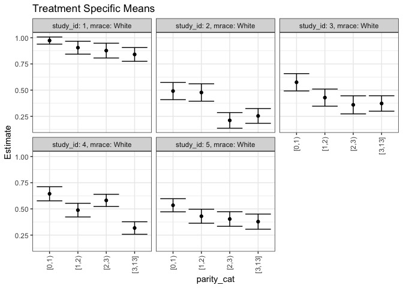
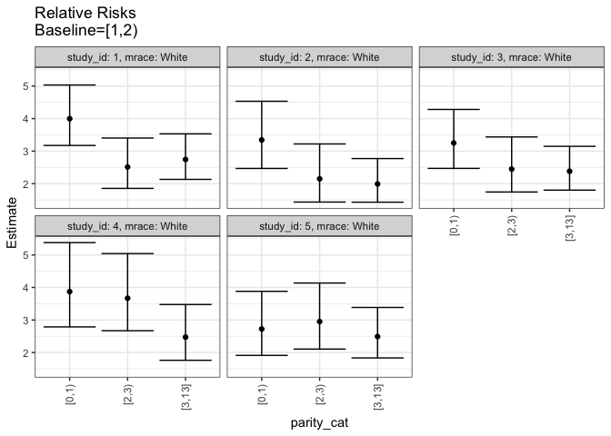
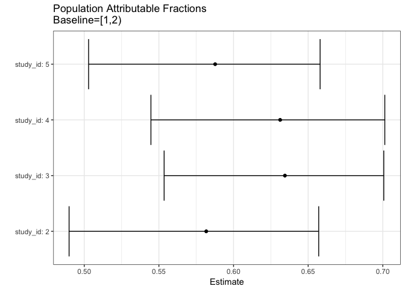
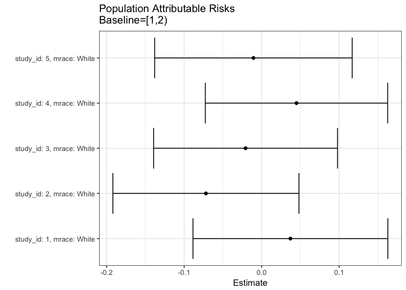

## Methods
## Outcome Variable

**Outcome Variable:** haz01

## Predictor Variables

**Intervention Variable:** parity_cat

**Adjustment Set:**

* gagebrth
* mage
* sexn
* apgar1
* apgar5
* meducyrs
* delta_apgar1
* delta_apgar5
* delta_meducyrs

## Stratifying Variables

The analysis was stratified on these variable(s):

* study_id
* mrace

## Data Summary

 study_id  mrace   parity_cat    haz01   n_cell     n
---------  ------  -----------  ------  -------  ----
        1  Black   [0,1)             0        2    26
        1  Black   [0,1)             1        2    26
        1  Black   [1,2)             0        4    26
        1  Black   [1,2)             1        4    26
        1  Black   [2,3)             0        5    26
        1  Black   [2,3)             1        1    26
        1  Black   [3,13]            0        2    26
        1  Black   [3,13]            1        6    26
        1  White   [0,1)             0        7   263
        1  White   [0,1)             1       43   263
        1  White   [1,2)             0       22   263
        1  White   [1,2)             1       36   263
        1  White   [2,3)             0       24   263
        1  White   [2,3)             1       32   263
        1  White   [3,13]            0       37   263
        1  White   [3,13]            1       62   263
        2  Black   [0,1)             0        0    22
        2  Black   [0,1)             1        3    22
        2  Black   [1,2)             0        1    22
        2  Black   [1,2)             1        2    22
        2  Black   [2,3)             0        3    22
        2  Black   [2,3)             1        1    22
        2  Black   [3,13]            0        1    22
        2  Black   [3,13]            1       11    22
        2  White   [0,1)             0       14   254
        2  White   [0,1)             1       28   254
        2  White   [1,2)             0       30   254
        2  White   [1,2)             1       37   254
        2  White   [2,3)             0       26   254
        2  White   [2,3)             1       19   254
        2  White   [3,13]            0       62   254
        2  White   [3,13]            1       38   254
        3  Black   [0,1)             0        1    27
        3  Black   [0,1)             1        1    27
        3  Black   [1,2)             0        6    27
        3  Black   [1,2)             1        4    27
        3  Black   [2,3)             0        1    27
        3  Black   [2,3)             1        1    27
        3  Black   [3,13]            0        5    27
        3  Black   [3,13]            1        8    27
        3  White   [0,1)             0       16   269
        3  White   [0,1)             1       35   269
        3  White   [1,2)             0       28   269
        3  White   [1,2)             1       39   269
        3  White   [2,3)             0       23   269
        3  White   [2,3)             1       25   269
        3  White   [3,13]            0       51   269
        3  White   [3,13]            1       52   269
        4  Black   [0,1)             0        0    19
        4  Black   [0,1)             1        1    19
        4  Black   [1,2)             0        3    19
        4  Black   [1,2)             1        4    19
        4  Black   [2,3)             0        4    19
        4  Black   [2,3)             1        0    19
        4  Black   [3,13]            0        2    19
        4  Black   [3,13]            1        5    19
        4  White   [0,1)             0       17   275
        4  White   [0,1)             1       30   275
        4  White   [1,2)             0       37   275
        4  White   [1,2)             1       33   275
        4  White   [2,3)             0       24   275
        4  White   [2,3)             1       38   275
        4  White   [3,13]            0       55   275
        4  White   [3,13]            1       41   275
        5  Black   [0,1)             0        0    21
        5  Black   [0,1)             1        2    21
        5  Black   [1,2)             0        0    21
        5  Black   [1,2)             1        3    21
        5  Black   [2,3)             0        3    21
        5  Black   [2,3)             1        5    21
        5  Black   [3,13]            0        1    21
        5  Black   [3,13]            1        7    21
        5  White   [0,1)             0       21   252
        5  White   [0,1)             1       25   252
        5  White   [1,2)             0       27   252
        5  White   [1,2)             1       32   252
        5  White   [2,3)             0       19   252
        5  White   [2,3)             1       27   252
        5  White   [3,13]            0       51   252
        5  White   [3,13]            1       50   252

The following strata were considered:

* study_id: 1, mrace: Black
* study_id: 1, mrace: White
* study_id: 2, mrace: Black
* study_id: 2, mrace: White
* study_id: 3, mrace: Black
* study_id: 3, mrace: White
* study_id: 4, mrace: Black
* study_id: 4, mrace: White
* study_id: 5, mrace: Black
* study_id: 5, mrace: White

### Dropped Strata

Some strata were dropped due to rare outcomes:

* study_id: 1, mrace: Black
* study_id: 2, mrace: Black
* study_id: 3, mrace: Black
* study_id: 4, mrace: Black
* study_id: 5, mrace: Black

## Methods Detail

We're interested in the causal parameters $E[Y_a]$ for all values of $a \in \mathcal{A}$. These parameters represent the mean outcome if, possibly contrary to fact, we intervened to set all units to have $A=a$. Under the randomization and positivity assumptions, these are identified by the statistical parameters $\psi_a=E_W[E_{Y|A,W}(Y|A=a,W)]$.  In addition, we're interested in the mean of $Y$, $E[Y]$ under no intervention (the observed mean). We will estimate these parameters by using SuperLearner to fit the relevant likelihood factors -- $E_{Y|A,W}(Y|A=a,W)$ and $p(A=a|W)$, and then updating our likelihood fit using a joint TMLE.

For unadjusted analyses ($W=\{\}$), initial likelihoods were estimated using Lrnr_glm to estimate the simple $E(Y|A)$ and Lrnr_mean to estimate $p(A)$. For adjusted analyses, a small library containing Lrnr_glmnet, Lrnr_xgboost, and Lrnr_mean was used.

Having estimated these parameters, we will then use the delta method to estimate relative risks and attributable risks relative to a prespecified baseline level of $A$.

todo: add detail about dropping strata with rare outcomes, handling missingness

# Results Detail

## Results Plots
<!-- -->

<!-- -->

<!-- -->

<!-- -->

## Results Table

### Parameter: TSM

 study_id  mrace   intervention_level   baseline_level     estimate    ci_lower    ci_upper
---------  ------  -------------------  ---------------  ----------  ----------  ----------
        1  White   [0,1)                NA                0.8600000   0.7539632   0.9660368
        1  White   [1,2)                NA                0.6206897   0.4914888   0.7498905
        1  White   [2,3)                NA                0.5714286   0.4282442   0.7146130
        1  White   [3,13]               NA                0.6262626   0.5245085   0.7280168
        2  White   [0,1)                NA                0.6559457   0.4875917   0.8242998
        2  White   [1,2)                NA                0.5468447   0.4201016   0.6735879
        2  White   [2,3)                NA                0.4286305   0.2947430   0.5625180
        2  White   [3,13]               NA                0.3821925   0.2851330   0.4792519
        3  White   [0,1)                NA                0.6867286   0.5428436   0.8306136
        3  White   [1,2)                NA                0.5814105   0.4557573   0.7070637
        3  White   [2,3)                NA                0.5184281   0.3742945   0.6625618
        3  White   [3,13]               NA                0.5062150   0.4059063   0.6065238
        4  White   [0,1)                NA                0.6339899   0.4700373   0.7979425
        4  White   [1,2)                NA                0.4758182   0.3515222   0.6001142
        4  White   [2,3)                NA                0.6033768   0.4806536   0.7261001
        4  White   [3,13]               NA                0.4436452   0.3399108   0.5473796
        5  White   [0,1)                NA                0.5457685   0.3912709   0.7002660
        5  White   [1,2)                NA                0.5559255   0.4307395   0.6811115
        5  White   [2,3)                NA                0.5797653   0.4303751   0.7291555
        5  White   [3,13]               NA                0.4987243   0.3970675   0.6003810

### Parameter: E(Y)

 study_id  mrace   intervention_level   baseline_level     estimate    ci_lower    ci_upper
---------  ------  -------------------  ---------------  ----------  ----------  ----------
        1  White   NA                   NA                0.6577947   0.5960367   0.7195527
        2  White   NA                   NA                0.4803150   0.4153958   0.5452341
        3  White   NA                   NA                0.5613383   0.4985612   0.6241154
        4  White   NA                   NA                0.5163636   0.4526929   0.5800343
        5  White   NA                   NA                0.5317460   0.4660920   0.5974001

### Parameter: RR

 study_id  mrace   intervention_level   baseline_level     estimate    ci_lower    ci_upper
---------  ------  -------------------  ---------------  ----------  ----------  ----------
        1  White   [0,1)                [1,2)             1.3855556   1.0878519   1.7647294
        1  White   [1,2)                [1,2)             1.0000000   1.0000000   1.0000000
        1  White   [2,3)                [1,2)             0.9206349   0.6648297   1.2748658
        1  White   [3,13]               [1,2)             1.0089787   0.7752766   1.3131288
        2  White   [0,1)                [1,2)             1.1995100   0.8491624   1.6944042
        2  White   [1,2)                [1,2)             1.0000000   1.0000000   1.0000000
        2  White   [2,3)                [1,2)             0.7838249   0.5318403   1.1551991
        2  White   [3,13]               [1,2)             0.6989049   0.4965599   0.9837043
        3  White   [0,1)                [1,2)             1.1811424   0.8748338   1.5946999
        3  White   [1,2)                [1,2)             1.0000000   1.0000000   1.0000000
        3  White   [2,3)                [1,2)             0.8916731   0.6278163   1.2664229
        3  White   [3,13]               [1,2)             0.8706671   0.6498300   1.1665533
        4  White   [0,1)                [1,2)             1.3324203   0.9230345   1.9233777
        4  White   [1,2)                [1,2)             1.0000000   1.0000000   1.0000000
        4  White   [2,3)                [1,2)             1.2680826   0.9114301   1.7642972
        4  White   [3,13]               [1,2)             0.9323837   0.6568936   1.3234096
        5  White   [0,1)                [1,2)             0.9817295   0.6849202   1.4071608
        5  White   [1,2)                [1,2)             1.0000000   1.0000000   1.0000000
        5  White   [2,3)                [1,2)             1.0428832   0.7395666   1.4705982
        5  White   [3,13]               [1,2)             0.8971063   0.6621537   1.2154272

### Parameter: PAR

 study_id  mrace   intervention_level   baseline_level      estimate     ci_lower    ci_upper
---------  ------  -------------------  ---------------  -----------  -----------  ----------
        1  White   [1,2)                NA                 0.0371050   -0.0778393   0.1520494
        2  White   [1,2)                NA                -0.0665298   -0.1743819   0.0413223
        3  White   [1,2)                NA                -0.0200722   -0.1283737   0.0882292
        4  White   [1,2)                NA                 0.0405454   -0.0670019   0.1480927
        5  White   [1,2)                NA                -0.0241795   -0.1348256   0.0864667

### Parameter: PAF

 study_id  mrace   intervention_level   baseline_level      estimate     ci_lower    ci_upper
---------  ------  -------------------  ---------------  -----------  -----------  ----------
        1  White   [1,2)                NA                 0.0564082   -0.1355076   0.2158877
        2  White   [1,2)                NA                -0.1385128   -0.3873272   0.0656772
        3  White   [1,2)                NA                -0.0357578   -0.2478391   0.1402784
        4  White   [1,2)                NA                 0.0785210   -0.1553042   0.2650217
        5  White   [1,2)                NA                -0.0454718   -0.2762125   0.1435506

